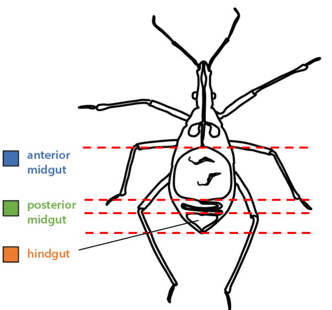

# *R. prolixus* metabolites

# Experimental design
Here we are exploring metabolites present in different gut sections of a triatomine insect, *Rhodnius prolixus*. These insects are vectors of the parasite, *Trypanosoma cruzi*, which cause Chagas disease. For this experiment, we have fed insects on blood containing either *T. cruzi*, *T. rangeli* (a non-infectious relative) or not infected at all (control samples). The parasites lifecycle involves different processes in each of the gut compartments, so we sought to investigate what metabolites are present in each of the different compartments.

At different time points we dissected the insects, separated the gut compartments and extracted the chemical compounds. These were then analyzed by HPLC/MS2 and pre-processed with:

1. [MZmine2](http://mzmine.github.io/) for pre-processing and peak picking\n",
2. [GNPS Feature Based Molecular Networking](https://gnps.ucsd.edu/ProteoSAFe/index.jsp?params=%7B%22workflow%22:%22FEATURE-BASED-MOLECULAR-NETWORKING%22,%22library_on_server%22:%22d.speclibs;%22%7D)

Here we take the raw data, clean and process it, engineer new features based on chemical structure, and then analyze the dataset with different machine learning models to predict whether an insect was exposed to parasite or not. We subsequently analyze the features that shape the predictions in each model and attempt to determine what that compound is.

Ultimately, we hope to be able to sample insects in the environment and determine if they have been exposed to the parasite, allowing for rapid intervention to prevent the spread of disease.  

For a summary of the analysis see the ModelSummary notebook.
